# Software Architecture

This document provides a detailed overview of the Self-Playing Chessboard software architecture, component interactions, and data flow.

## System Overview

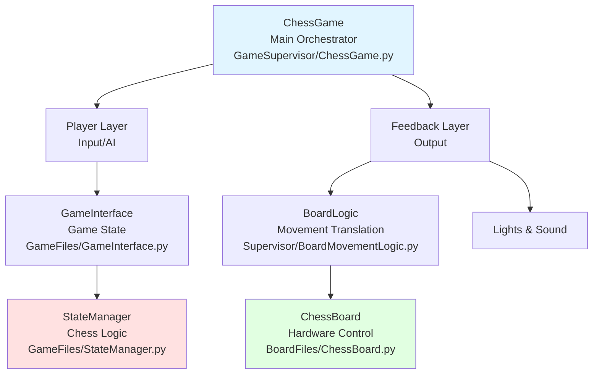

## Layer Architecture

### 1. Orchestration Layer

**ChessGame** (`GameSupervisor/ChessGame.py`)
- Main game loop and event handling
- Coordinates all subsystems
- Manages game modes (Human vs Human, Human vs AI, AI vs AI)
- Handles reset button events and mode switching
- Error handling and exception management

```python
class ChessGame:
    - backends: Dict[str, GameInterface]  # Different game modes
    - board: BoardLogic                    # Physical board controller
    - lights: LightsInterface              # LED feedback
    - audio: SoundController               # Audio feedback
```

### 2. Player Layer

Players interact with the game through a common interface:

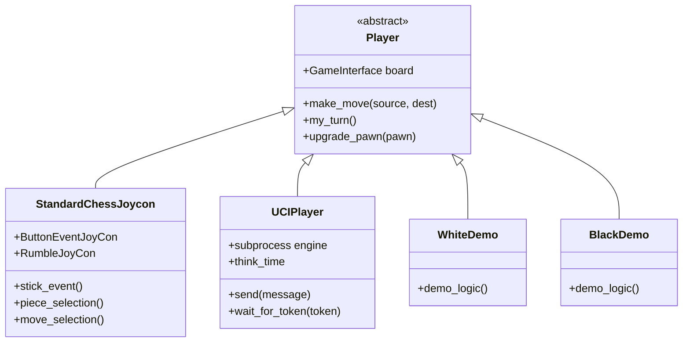

#### StandardChessJoycon (`JoyconInterface/Joycon.py`)
- Interfaces with Nintendo Joy-Con controllers via Bluetooth
- Implements directional piece selection algorithm
- State machine: `piece_selection` → `move_selection` → `execute`
- Stick monitoring thread for real-time input
- Haptic feedback via rumble

**Selection Algorithm**:
```
Current piece position → Joystick angle → Find closest piece
   in direction using vector math and distance scoring
```

#### UCIPlayer (`CPUChessPlayers/UCIPlayer.py`)
- Communicates with UCI chess engines via subprocess
- Manages engine lifecycle (uci, ucinewgame, position, go, stop)
- Converts between FEN strings and game state
- Handles pawn promotion decisions
- Optional pondering for faster responses

**UCI Communication Flow**:

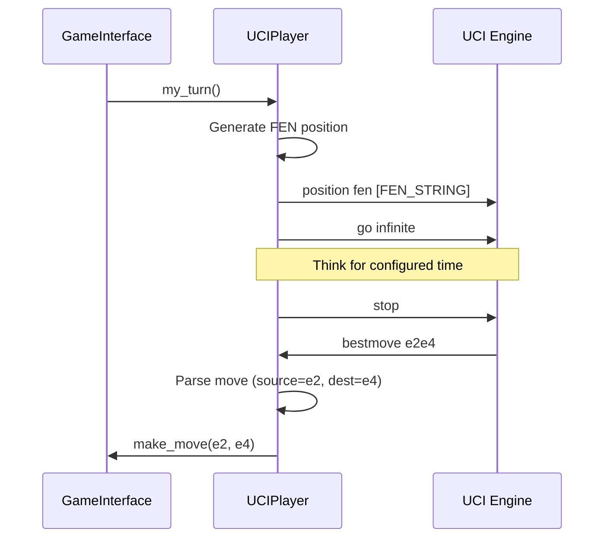

#### Demo Bots (`CPUChessPlayers/DemonstrationBots.py`)
- Simple AI for demonstration mode
- WhiteDemo and BlackDemo instances
- Useful for testing board movements

### 3. Game State Layer

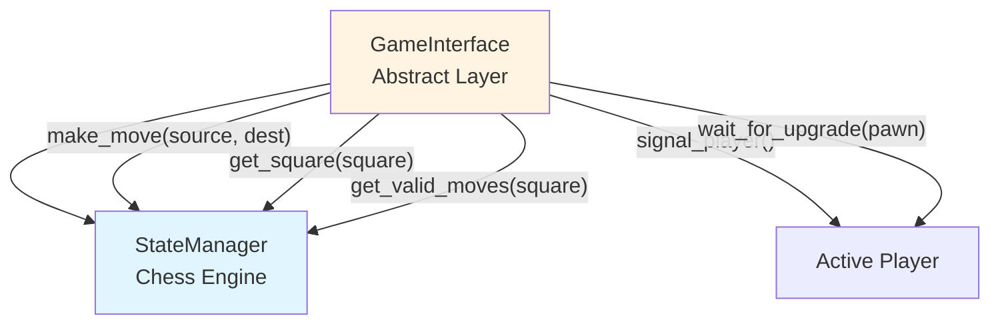

#### StateManager (`GameFiles/StateManager.py`)

**Class Hierarchy**:

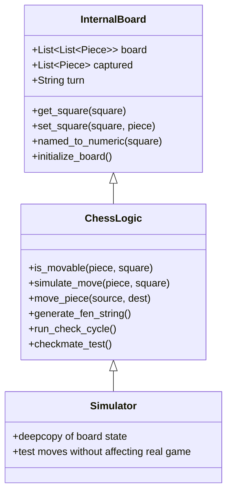

**Core Responsibilities**:
- 8x8 board state representation
- Full chess rule implementation
- Move validation and legal move generation
- Check, checkmate, and stalemate detection
- FEN string generation for UCI engines
- Special move handling (castling, en passant, pawn promotion)
- Move history tracking

**Move Validation Process**:

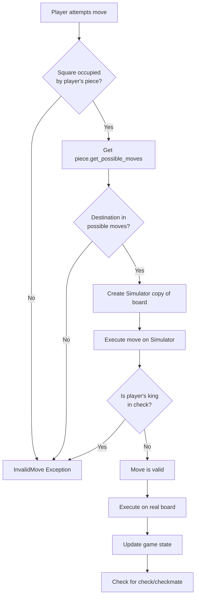

#### ChessPieces (`GameFiles/ChessPieces.py`)

Each piece type implements its own move logic:
```python
class Piece:
    def get_possible_moves(self) -> List[str]

class Pawn(Piece):      # Forward movement, diagonal capture, en passant
class Rook(Piece):      # Horizontal/vertical lines
class Knight(Piece):    # L-shaped jumps
class Bishop(Piece):    # Diagonal lines
class Queen(Piece):     # Combines rook and bishop
class King(Piece):      # One square any direction + castling
```

Special pieces:
- `GhostPawn`: Represents en passant target square
- `SuperPawn`: Wrapper for promoted pawn

### 4. Movement Translation Layer

**BoardMovementLogic** (`GameSupervisor/BoardMovementLogic.py`)
- Translates chess moves to physical board movements
- Handles piece capture routing
- Manages castling rook movements
- Coordinates pawn promotion with hardware

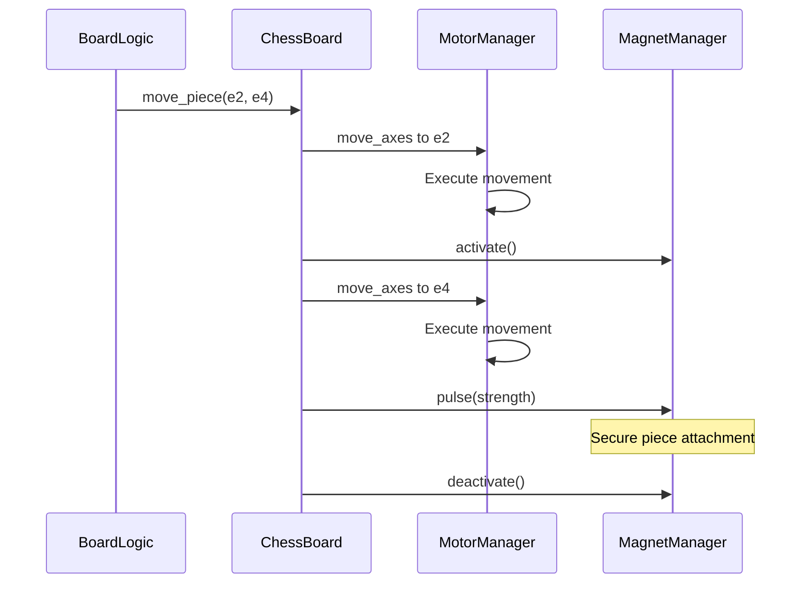

### 5. Hardware Control Layer

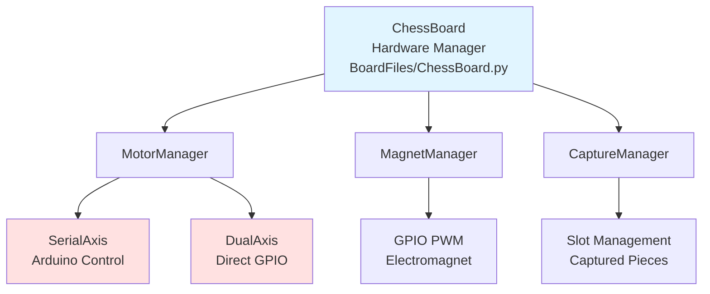

#### MotorManager (`BoardFiles/MotorManager.py`)

**SerialAxis** (Primary implementation):

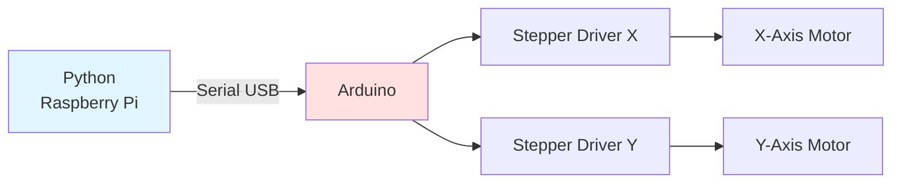

**Protocol**:
```
Command: MV <y_pos> <x_pos> <y_delay> <x_delay>
Response: Status acknowledgment

Multiple commands queued with | separator:
"MV 50 50 45 45|MV 75 75 85 85"
```

**DualAxis** (Alternative implementation):
- Direct GPIO control of stepper motors
- Threaded execution for X and Y axes
- Limit switch homing and calibration

#### Coordinate Transformation

Chess notation → Motor coordinates via bilinear interpolation:

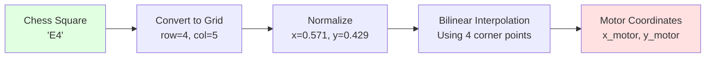

Formula accounts for:
- Board rotation
- Non-square board dimensions
- Physical misalignment

#### MagnetManager (`BoardFiles/MagnetManager.py`)
- GPIO control of electromagnet
- PWM support for variable strength
- Pulse mode for secure attachment

#### CaptureManagement (`BoardFiles/CaptureManagement.py`)
- Manages captured piece storage slots
- Routes captured pieces off-board
- Tracks slot availability
- Handles piece return during reset

### 6. Feedback Layer

#### NeoPixel Lights (`NeopixelLights/LightManager.py`)

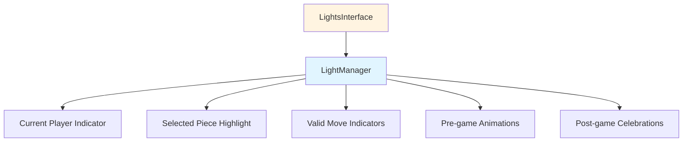

**Color Scheme**:
- White: White team indicator
- Blue: Selected piece
- Green: Valid move destinations
- Red: Black team indicator
- Animations: Rainbow patterns for game events

#### Sound System (`SoundPlayer/`)

**SoundController** (`GameSupervisor/SoundController.py`)
- High-level audio coordination
- Background music management
- Event-triggered sound effects

**SoundManager** (`SoundPlayer/SoundManager.py`)
- Audio playback engine
- Multiple simultaneous tracks
- Voice clips for instructions

**Audio Events**:
- Game intro/outro music
- Check notification
- Checkmate celebration
- Stalemate sound
- Move confirmation beeps
- Pawn promotion instructions

## Data Flow Examples

### Human vs AI Move

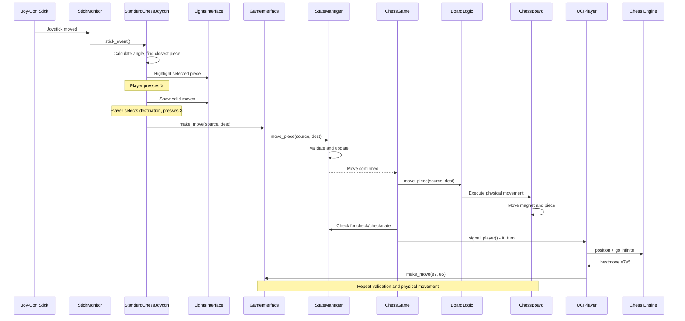

### Castling Move

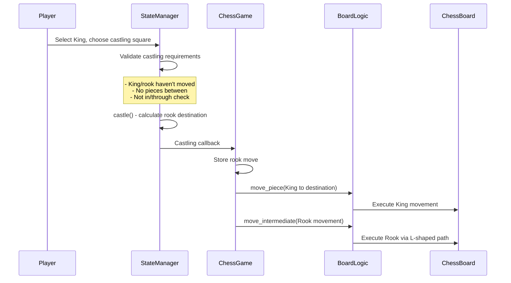

### En Passant

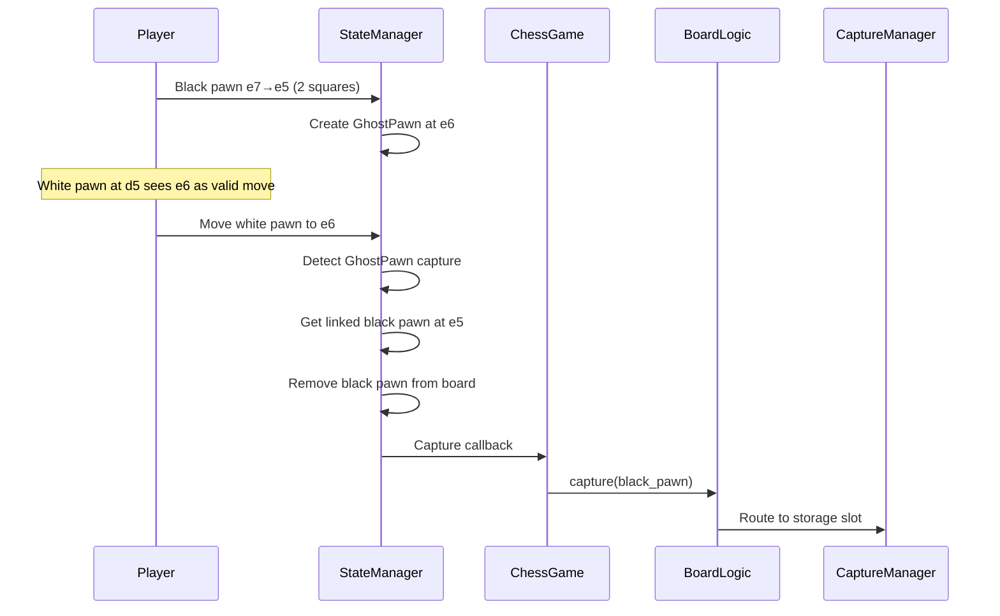

## Threading Model

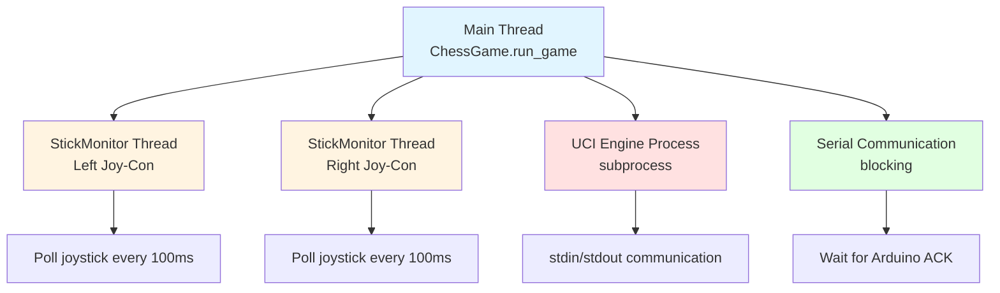

## Error Handling

Exception hierarchy:

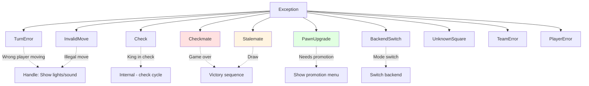

Exceptions bubble up from StateManager → GameInterface → ChessGame, where they're caught and handled appropriately (e.g., play sound, show lights, execute final move for checkmate).

## Configuration Points

### Hardware Calibration
- `ChessBoard.py`: Corner positions (`sq_1` through `sq_4`)
- `MotorManager.py`: Motor delay settings (`travel_speed`, `move_speed`) - lower values = faster
- `MagnetManager.py`: PWM duty cycle for electromagnet strength

### Game Configuration
- `ChessGame.py`: UCI engine paths and arguments
- `UCIPlayer.py`: Think time (`think_time` variable)
- `Joycon.py`: Joystick tolerance and selection algorithm tuning

### GPIO Pin Mapping
- `BoardFiles/__init__.py`: Pin definitions for buttons and peripherals
- `MotorManager.py`: Stepper driver pins (enable, step, direction, limits)
- `MagnetManager.py`: Electromagnet control pin
- `LightManager.py`: NeoPixel data pin

## Extension Points

### Adding New Player Types
```python
class MyPlayer(Player):
    def __init__(self, game_interface):
        super().__init__(game_interface)

    def my_turn(self):
        # Calculate move
        self.make_move(source, dest)

    def upgrade_pawn(self, pawn):
        return "Queen"  # or other piece
```

### Adding New Chess Engines
```python
UCIPlayer(
    backend,
    "/path/to/engine",
    "engine_executable",
    args=["--option1=value1", "--option2=value2"]
)
```

### Customizing Movement Patterns
Override methods in `ChessBoard`:
- `move_piece()` for standard moves
- `move_between()` for special paths (currently used for knights)
- `move_intermediate()` for multi-waypoint moves

## Performance Considerations

**Move Execution Time**:
- Standard move: ~2-5 seconds (depends on distance)
- Knight move: ~3-6 seconds (curved path)
- Castling: ~5-8 seconds (two-piece move)
- Capture: +2-3 seconds (additional routing to storage)

**UCI Engine Think Time**:
- Default: 3 seconds per move
- Configurable in `UCIPlayer.think_time`
- Affects game pace significantly

**Motor Speed vs Accuracy Trade-off**:

Note: These values represent **motor step delays** sent to the Arduino (in microseconds). Lower delay values = faster movement.

- `travel_speed=45`: Lower delay → **Fast movement** when repositioning without piece attached
- `move_speed=85`: Higher delay → **Slower movement** for secure piece transport
- **Lower delay values** = Faster but less precise, higher risk of piece slipping
- **Higher delay values** = Slower but more controlled, secure piece attachment

## Future Architecture Considerations

**Potential Enhancements**:
1. Piece detection via hall effect sensors (eliminate need for game state tracking)
2. Web interface layer (WebSocket communication with browser client)
3. Game recording to PGN format (add PGNWriter module)
4. Opening book integration (database layer for stored positions)
5. Elo rating system for human players (persistent storage layer)
6. Computer vision for automatic calibration (CV module interfacing with camera)

---

**Last Updated**: Based on codebase state as of latest commit
